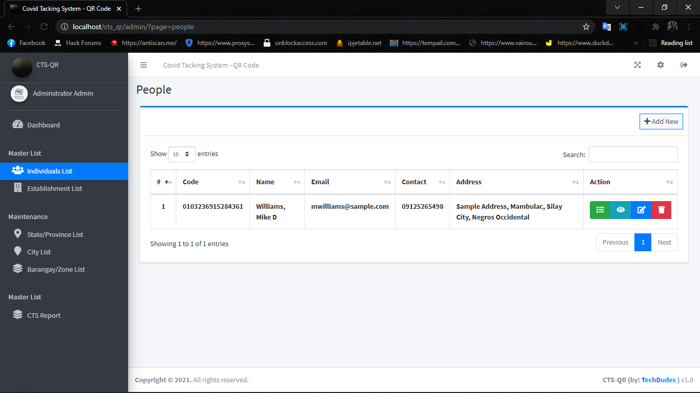
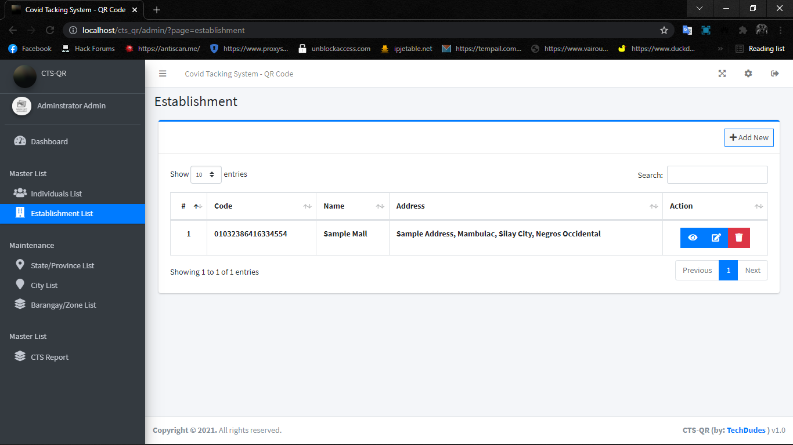
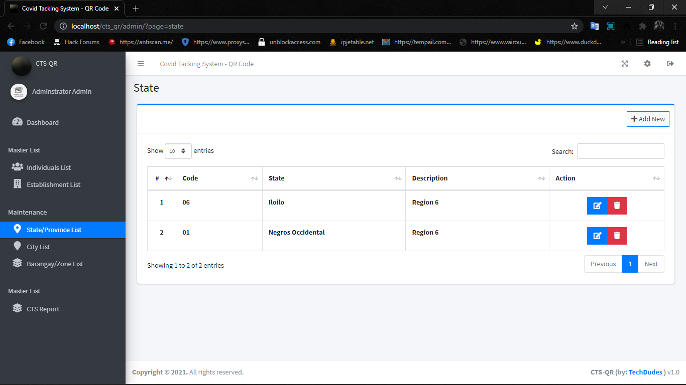
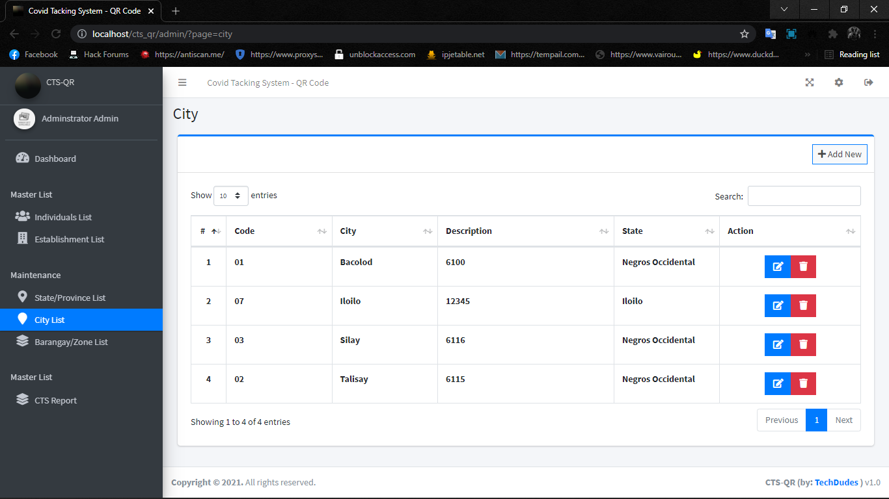
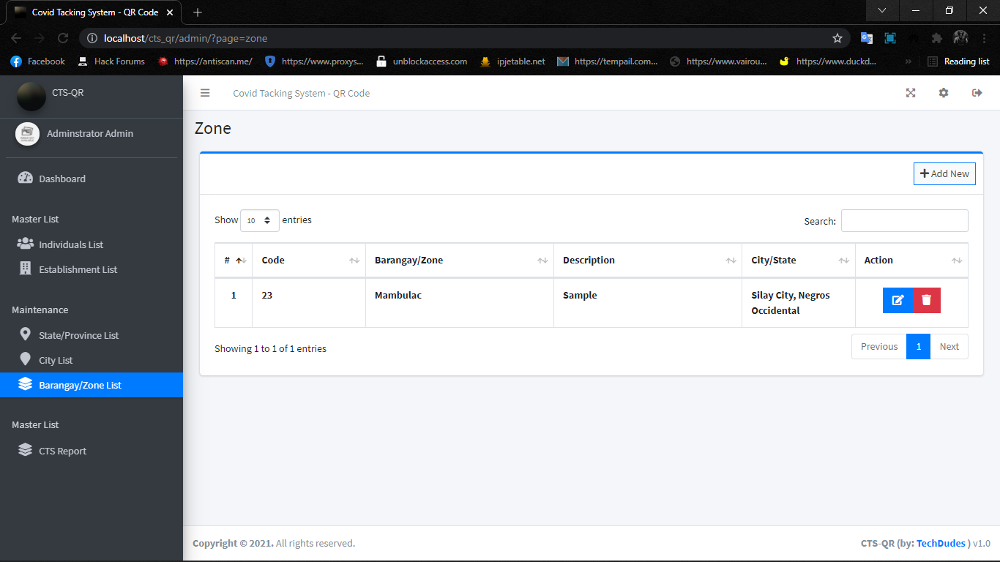
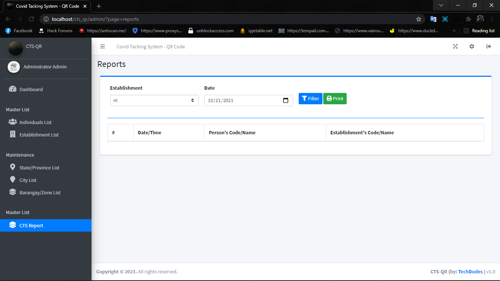
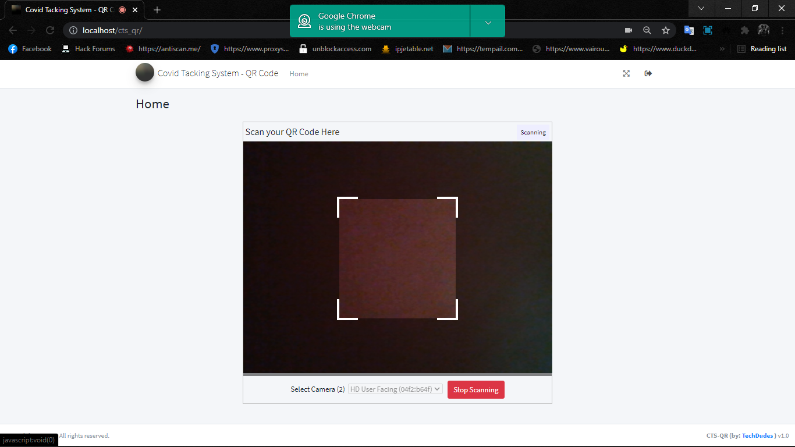
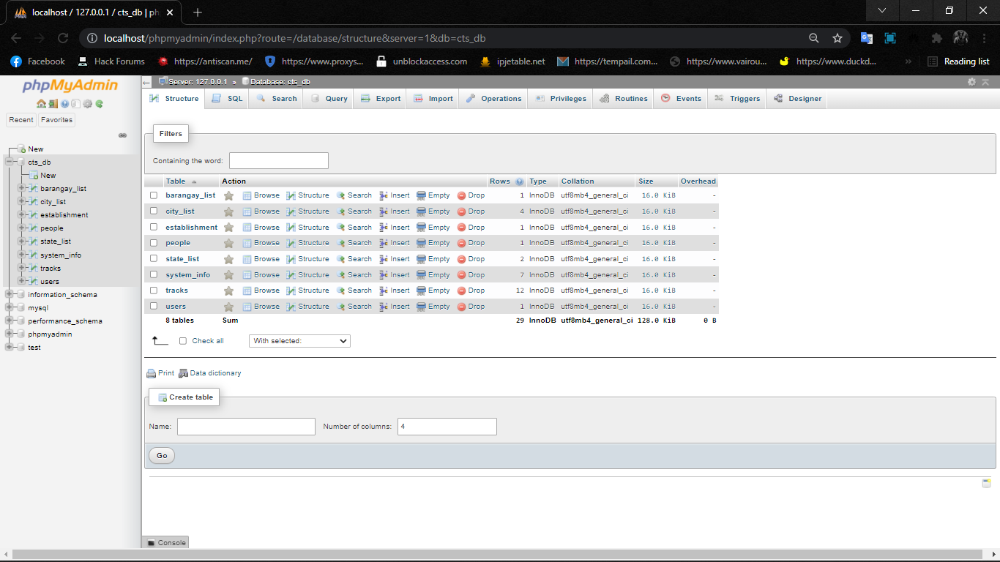

# Covid-19-Contact-Tracing-System-Web-App-with-QR-Code-Scanning-using-PHP
This project was inspired in the LGU's Contact Tracking System here in the Philippines. The Contact Tracing System logs all individuals that are visiting a certain establishment. The system has 2 sides of the user interface which are the Admin Panel and the Establishments Log's Side. The Admin Panel is the module of the project which are the system administrator will manage all the data such as the list of establishments and Individuals List. The system automatically generates a printable CTS QR Code Card (Contact Tracing System Quick Response Code Card) and this card will be the identification of the individuals for entering the establishment. Talking about the Establishment Log's Side, each establishment that is registered in the system will a system-generated code which will be used by the establishment's staff to access the QR Code Scanning Feature. This module has only a single page after login because this side purpose is only to log the visitor's QR Code to log their information to the system that the certain individual has entered to the certain establishment in a certain time and date. This project also generates printable reports

# Features:
* Admin Panel
* System Information Management
* Province List Management
* City List Management
* Zone List Management
* Individual List Management
* Generates QR Code ID Card
* Scanning QR Code to Log
* Generates Reports

# How to Run ??
## Requirements

Download and Install any local web server such as XAMPP/WAMP.
https://www.apachefriends.org/index.html

# Installation/Setup
1. Open your XAMPP/WAMP's Control Panel and start Apache and MySQL.
2. Extract the downloaded source code zip file.
3. If you are using XAMPP, copy the extracted source code folder and paste it into the XAMPP's "htdocs" directory. And If you are using WAMP, paste it into the "www" directory.
4. Browse the PHPMyAdmin in a browser. i.e. http://localhost/phpmyadmin
5. Create a new database naming vaccinated_db.
6. Import the provided SQL file. The file is known as vaccinated_db.sql located inside the database folder.
7. Browse the Centralize Covid Vaccination Record System in a browser. i.e. http://localhost/vaccinated/.

# Default Admin Access Information
## Username: admin
## Password: admin123

That's it. You can now explore the features and functionalities of this Centralize Covid Vaccination Record System in PHP. I hope this project will help you with what you are looking for and you'll find something useful for your future projects.

